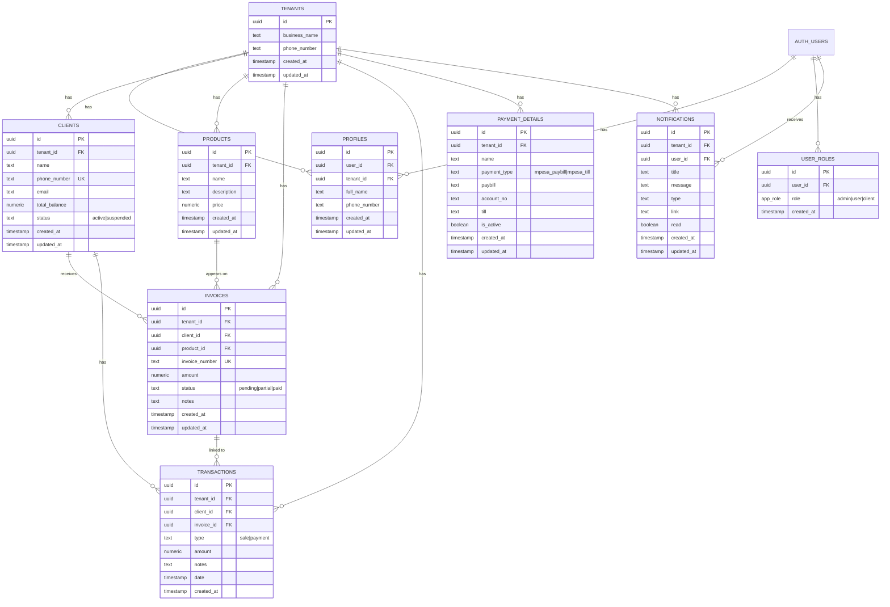

# Lipia Pole Pole - Architecture Documentation

> A comprehensive domain-driven architecture guide for the Lipia Pole Pole credit management system.

---

## Table of Contents

1. [Domain Overview](#1-domain-overview)
2. [Ubiquitous Language](#2-ubiquitous-language)
3. [Bounded Contexts](#3-bounded-contexts)
4. [Entity Relationship Diagram](#4-entity-relationship-diagram)
5. [Domain Structure](#5-domain-structure)
6. [State Machines](#6-state-machines)
7. [Business Rules & Invariants](#7-business-rules--invariants)
8. [Multi-tenancy Pattern](#8-multi-tenancy-pattern)
9. [Authentication & Authorization](#9-authentication--authorization)
10. [Domain Events](#10-domain-events)
11. [API Layer Patterns](#11-api-layer-patterns)
12. [Error Handling Strategy](#12-error-handling-strategy)
13. [Design System](#13-design-system)
14. [Tech Stack](#14-tech-stack)
15. [Conventions](#15-conventions)

---

## 1. Domain Overview

### What is Lipia Pole Pole?

**Lipia Pole Pole** (Swahili for "Pay Slowly") is a B2B credit management platform designed for small and medium enterprises (SMEs) in East Africa. It enables businesses to offer credit/installment payment options to their customers while maintaining clear visibility of outstanding balances and payment histories.

### Problem Statement

Small businesses struggle to:
- Track customer credit and outstanding balances manually
- Generate and manage invoices for goods sold on credit
- Record payments and reconcile accounts
- Maintain clear payment terms and history

### Solution

A multi-tenant SaaS platform that provides:
- **Centralized credit tracking** per customer
- **Invoice generation** linked to products/services
- **Transaction recording** for payments and sales
- **Client self-service portal** for balance viewing and payments
- **Payment details management** for M-Pesa integration

### Target Users

| User Type | Role | Access Level |
|-----------|------|--------------|
| **Business Owner** | Admin | Full system access, tenant management |
| **Staff Member** | User | Client & invoice management within tenant |
| **Customer** | Client | View own balance, invoices, make payments |

---

## 2. Ubiquitous Language

> A shared vocabulary used consistently across code, documentation, and communication.

| Term | Definition | Code Reference |
|------|------------|----------------|
| **Tenant** | A business organization using the platform. Each tenant operates in complete isolation. | `tenants` table |
| **Profile** | A user account belonging to a tenant (Admin or Staff). | `profiles` table |
| **Client** | A customer of a tenant who purchases goods/services on credit. | `clients` table |
| **Invoice** | A billing document issued to a client for goods/services. Creates a receivable. | `invoices` table |
| **Transaction** | A financial record representing money movement (payment or sale). | `transactions` table |
| **Product** | A good or service offered by a tenant, with a defined price. | `products` table |
| **Balance** | A client's current outstanding credit amount (Total Invoiced - Total Paid). | `total_balance` column |
| **Top-Up** | A client adding funds/making a payment to reduce their balance. | Transaction with type `payment` |
| **Sale** | Recording a credit sale to a client, increasing their balance. | Transaction with type `sale` |
| **Payment Details** | M-Pesa Paybill or Till configuration for receiving payments. | `payment_details` table |
| **Notification** | System-generated alerts for users about important events. | `notifications` table |

---

## 3. Bounded Contexts

> Logical boundaries that encapsulate related domain concepts.

```
┌─────────────────────────────────────────────────────────────────────────────┐
│                           LIPIA POLE POLE SYSTEM                            │
└─────────────────────────────────────────────────────────────────────────────┘
                                      │
          ┌───────────────────────────┼───────────────────────────┐
          │                           │                           │
          ▼                           ▼                           ▼
┌─────────────────────┐    ┌─────────────────────┐    ┌─────────────────────┐
│  IDENTITY CONTEXT   │    │   BILLING CONTEXT   │    │  CATALOG CONTEXT    │
│  ─────────────────  │    │  ─────────────────  │    │  ─────────────────  │
│                     │    │                     │    │                     │
│  • Tenants          │───▶│  • Invoices         │◀───│  • Products         │
│  • Profiles         │    │  • Transactions     │    │                     │
│  • User Roles       │    │  • Payment Details  │    │                     │
│  • Authentication   │    │                     │    │                     │
│                     │    │                     │    │                     │
│  Responsibility:    │    │  Responsibility:    │    │  Responsibility:    │
│  Who can access     │    │  Money tracking     │    │  What is sold       │
│  the system?        │    │  and reconciliation │    │  and at what price? │
└─────────────────────┘    └─────────────────────┘    └─────────────────────┘
          │                           │
          │                           │
          ▼                           ▼
┌─────────────────────┐    ┌─────────────────────┐
│  CUSTOMER CONTEXT   │    │ NOTIFICATION CONTEXT│
│  ─────────────────  │    │  ─────────────────  │
│                     │    │                     │
│  • Clients          │    │  • Notifications    │
│  • Client Portal    │    │  • Alerts           │
│  • Balance View     │    │                     │
│                     │    │                     │
│  Responsibility:    │    │  Responsibility:    │
│  Customer records   │    │  System alerts      │
│  and self-service   │    │  and messaging      │
└─────────────────────┘    └─────────────────────┘
```

### Context Interactions

| From Context | To Context | Interaction |
|--------------|------------|-------------|
| Identity → Billing | Tenant ID provides scope for all billing operations |
| Identity → Customer | Tenant ID scopes client records |
| Catalog → Billing | Products referenced in invoices for pricing |
| Billing → Customer | Transactions update client balances |
| All Contexts → Notification | Events trigger user notifications |

---

## 4. Entity Relationship Diagram



### Key Relationships

| Relationship | Cardinality | Description |
|--------------|-------------|-------------|
| Tenant → Clients | 1:N | A tenant has many clients |
| Tenant → Products | 1:N | A tenant has many products |
| Client → Invoices | 1:N | A client can have many invoices |
| Client → Transactions | 1:N | A client has many transactions |
| Invoice → Transactions | 1:N | An invoice can have multiple payment transactions |
| Product → Invoices | 1:N | A product can appear on many invoices |

---

## 5. Domain Structure

### Project Organization

```
src/
├── api/                    # Data access layer
│   ├── clients.api.ts      # Client CRUD operations
│   ├── invoices.api.ts     # Invoice CRUD operations
│   ├── payments.api.ts     # Payment details operations
│   ├── products.api.ts     # Product CRUD operations
│   ├── notifications.api.ts # Notification operations
│   └── tenant.api.ts       # Tenant context utilities
│
├── components/             # Shared UI components
│   ├── ui/                 # Shadcn/Radix primitives
│   ├── auth/               # Authentication forms
│   ├── clients/            # Client-specific components
│   ├── invoices/           # Invoice-specific components
│   └── products/           # Product-specific components
│
├── features/               # Feature modules (domain-specific)
│   └── clients/
│       └── components/     # Client feature components
│
├── hooks/                  # React Query hooks & utilities
│   ├── useAuth.tsx         # Authentication state
│   ├── useClients.ts       # Client data hooks
│   ├── useInvoices.ts      # Invoice data hooks
│   ├── useProducts.ts      # Product data hooks
│   ├── usePayments.ts      # Payment details hooks
│   └── useUserRole.ts      # Role-based access
│
├── integrations/           # External service integrations
│   └── supabase/
│       ├── client.ts       # Supabase client (auto-generated)
│       └── types.ts        # Database types (auto-generated)
│
├── lib/                    # Utilities & helpers
│   ├── pdfGenerator.ts     # Invoice PDF generation
│   ├── queryClient.ts      # React Query configuration
│   ├── utils.ts            # General utilities
│   └── whatsapp.ts         # WhatsApp integration
│
├── pages/                  # Route components
│   ├── Auth.tsx            # Login/Signup
│   ├── Dashboard.tsx       # Admin dashboard
│   ├── Clients.tsx         # Client management
│   ├── Invoices.tsx        # Invoice management
│   ├── Products.tsx        # Product catalog
│   ├── Payments.tsx        # Payment settings
│   └── ClientDashboard.tsx # Client self-service
│
└── shared/                 # Cross-cutting concerns
    ├── components/         # Shared UI patterns
    ├── hooks/              # Shared hooks
    └── utils/              # Shared utilities
        ├── currency.ts     # Money formatting
        ├── date.ts         # Date formatting
        └── index.ts        # Barrel exports

supabase/
├── config.toml             # Supabase configuration
├── migrations/             # Database migrations
└── functions/              # Edge Functions
    ├── create-client-user/ # Client account creation
    ├── reset-password/     # Password reset flow
    ├── resolve-login-email/# Email resolution
    └── setup-tenant/       # Tenant provisioning
```

### Architecture Pattern

**Hybrid Layered + Feature-Based Architecture**

```
┌─────────────────────────────────────────────────────────────────┐
│                         PRESENTATION                             │
│   Pages (routes) → Components (UI) → Hooks (state/data)         │
└─────────────────────────────────────────────────────────────────┘
                              │
                              ▼
┌─────────────────────────────────────────────────────────────────┐
│                        APPLICATION                               │
│   React Query Hooks → API Functions → Business Logic            │
└─────────────────────────────────────────────────────────────────┘
                              │
                              ▼
┌─────────────────────────────────────────────────────────────────┐
│                       INFRASTRUCTURE                             │
│   Supabase Client → Database (PostgreSQL) → Edge Functions      │
└─────────────────────────────────────────────────────────────────┘
```

---

## 6. State Machines

### Invoice Status Flow

```
                    ┌──────────────────┐
                    │     PENDING      │
                    │   (amount > 0)   │
                    └────────┬─────────┘
                             │
              ┌──────────────┼──────────────┐
              │              │              │
              ▼              │              ▼
    ┌─────────────────┐      │    ┌─────────────────┐
    │     PARTIAL     │      │    │      PAID       │
    │ (0 < paid < amt)│──────┼───▶│  (paid >= amt)  │
    └─────────────────┘      │    └─────────────────┘
              │              │
              └──────────────┘
                    │
                    ▼
           Payment Transaction
              Recorded
```

| Status | Condition | User Action |
|--------|-----------|-------------|
| `pending` | Initial state, no payments | Invoice created |
| `partial` | Some payments made, balance remains | Payment recorded |
| `paid` | Full amount received | Final payment recorded |

### Client Status Flow

```
    ┌─────────────────┐
    │     ACTIVE      │
    │  (normal ops)   │
    └────────┬────────┘
             │
             │ Admin suspends
             ▼
    ┌─────────────────┐
    │   SUSPENDED     │
    │  (limited ops)  │
    └────────┬────────┘
             │
             │ Admin reactivates
             ▼
    ┌─────────────────┐
    │     ACTIVE      │
    └─────────────────┘
```

| Status | Permissions | Trigger |
|--------|-------------|---------|
| `active` | Full access to portal | Default on creation |
| `suspended` | Read-only, no new purchases | Admin action |

---

## 7. Business Rules & Invariants

### Core Business Rules

| Rule ID | Rule | Implementation |
|---------|------|----------------|
| **BR-001** | Client balance = Total Invoiced - Total Paid | `client_details` view calculates dynamically |
| **BR-002** | Invoice amounts must be positive (> 0) | Form validation + DB constraint |
| **BR-003** | Phone numbers must be unique per tenant | Unique constraint on `(tenant_id, phone_number)` |
| **BR-004** | All entities are tenant-scoped | RLS policies enforce `tenant_id` matching |
| **BR-005** | Invoice numbers are sequential per tenant | `generateInvoiceNumber()` function |
| **BR-006** | Only active payment details shown to clients | RLS policy filters `is_active = true` |
| **BR-007** | Transactions update client balance | Trigger/view recalculates on change |
| **BR-008** | Clients can only view their own data | RLS policies match `phone_number` to JWT |

### Aggregate Boundaries

| Aggregate Root | Child Entities | Invariants |
|----------------|----------------|------------|
| **Tenant** | Profiles, Clients, Products, Invoices, Transactions, Payment Details | All children must have matching `tenant_id` |
| **Client** | Transactions, Invoices | Balance must equal sum of transactions |
| **Invoice** | Transactions (payments) | Status reflects payment progress |

### Validation Rules

```typescript
// Client Validation
- name: optional, string
- phone_number: required, unique per tenant, format: +254XXXXXXXXX
- email: optional, valid email format
- status: enum ['active', 'suspended']

// Invoice Validation
- client_id: required, must exist in tenant
- amount: required, positive number
- invoice_number: auto-generated, unique per tenant
- status: enum ['pending', 'partial', 'paid']

// Transaction Validation
- client_id: required, must exist in tenant
- type: enum ['sale', 'payment']
- amount: required, positive number
- date: defaults to now()

// Product Validation
- name: required, string
- price: required, non-negative number
- description: optional, string
```

---

## 8. Multi-tenancy Pattern

### Tenant Isolation Strategy

**Row-Level Security (RLS)** ensures complete data isolation between tenants.

```
┌─────────────────────────────────────────────────────────────────┐
│                        REQUEST FLOW                              │
└─────────────────────────────────────────────────────────────────┘

  User Request
       │
       ▼
┌─────────────────┐
│   Auth Check    │ ──▶ JWT contains user_id
└────────┬────────┘
         │
         ▼
┌─────────────────┐
│ get_user_       │ ──▶ Looks up tenant_id from profiles table
│ tenant_id()     │
└────────┬────────┘
         │
         ▼
┌─────────────────┐
│   RLS Policy    │ ──▶ WHERE tenant_id = get_user_tenant_id()
└────────┬────────┘
         │
         ▼
┌─────────────────┐
│  Filtered Data  │ ──▶ Only tenant's data returned
└─────────────────┘
```

### Implementation Pattern

**Database Function:**
```sql
CREATE FUNCTION get_user_tenant_id() RETURNS uuid AS $$
  SELECT tenant_id FROM profiles WHERE user_id = auth.uid()
$$ LANGUAGE sql SECURITY DEFINER;
```

**RLS Policy Example:**
```sql
CREATE POLICY "Users can view clients in their tenant"
ON clients FOR SELECT
USING (tenant_id = get_user_tenant_id());
```

**API Layer Pattern:**
```typescript
// src/api/tenant.api.ts
export const getCurrentTenantId = async (): Promise<string> => {
  const { data } = await supabase.rpc('get_user_tenant_id');
  return data;
};

// All API functions use tenant_id
export const getClients = async () => {
  const tenantId = await getCurrentTenantId();
  return supabase.from('clients').select('*').eq('tenant_id', tenantId);
};
```

### Tenant Data Scope

| Table | Tenant-Scoped | Notes |
|-------|---------------|-------|
| `tenants` | ✓ (self) | Users can only see their own tenant |
| `profiles` | ✓ | Users in same tenant |
| `clients` | ✓ | All client records |
| `products` | ✓ | All products |
| `invoices` | ✓ | All invoices |
| `transactions` | ✓ | All transactions |
| `payment_details` | ✓ | Payment configurations |
| `notifications` | ✓ + user_id | User-specific within tenant |
| `user_roles` | ✗ | User can only see own roles |

---

## 9. Authentication & Authorization

### Authentication Flow

```
┌─────────────────────────────────────────────────────────────────┐
│                    AUTHENTICATION FLOWS                          │
└─────────────────────────────────────────────────────────────────┘

┌─────────────────┐     ┌─────────────────┐     ┌─────────────────┐
│  ADMIN/USER     │     │     CLIENT      │     │   NEW TENANT    │
│    LOGIN        │     │     LOGIN       │     │    SIGNUP       │
└────────┬────────┘     └────────┬────────┘     └────────┬────────┘
         │                       │                       │
         ▼                       ▼                       ▼
┌─────────────────┐     ┌─────────────────┐     ┌─────────────────┐
│ Email/Password  │     │ Phone + Tenant  │     │  Business Info  │
│   Standard      │     │  Edge Function  │     │  Edge Function  │
└────────┬────────┘     └────────┬────────┘     └────────┬────────┘
         │                       │                       │
         ▼                       ▼                       ▼
┌─────────────────┐     ┌─────────────────┐     ┌─────────────────┐
│  Supabase Auth  │     │ resolve-login   │     │  setup-tenant   │
│     Session     │     │    -email       │     │    function     │
└────────┬────────┘     └────────┬────────┘     └────────┬────────┘
         │                       │                       │
         ▼                       ▼                       ▼
┌─────────────────┐     ┌─────────────────┐     ┌─────────────────┐
│    Dashboard    │     │ ClientDashboard │     │    Dashboard    │
│   (Admin/User)  │     │   (Client)      │     │   (New Admin)   │
└─────────────────┘     └─────────────────┘     └─────────────────┘
```

### Role-Based Access Control (RBAC)

| Role | Access Scope | Capabilities |
|------|--------------|--------------|
| **admin** | Full tenant access | All CRUD operations, settings, user management |
| **user** | Tenant data access | Client, invoice, product management |
| **client** | Own data only | View balance, invoices, payment details |

### Role Check Implementation

```typescript
// src/hooks/useUserRole.ts
export const useUserRole = () => {
  const { data } = useQuery({
    queryKey: ['userRole'],
    queryFn: async () => {
      const { data } = await supabase
        .from('user_roles')
        .select('role')
        .eq('user_id', userId)
        .single();
      return data?.role;
    }
  });
  
  return {
    isAdmin: data === 'admin',
    isUser: data === 'user',
    isClient: data === 'client'
  };
};
```

### Edge Functions

| Function | Purpose | Trigger |
|----------|---------|---------|
| `setup-tenant` | Create new tenant + admin profile | Signup form |
| `create-client-user` | Create client auth account | Admin action |
| `resolve-login-email` | Map phone to internal email | Client login |
| `reset-password` | Handle password reset flow | Forgot password |

---

## 10. Domain Events

### Event Catalog

| Event | Trigger | Side Effects |
|-------|---------|--------------|
| **TenantCreated** | New business signup | Admin profile created, welcome notification |
| **ClientCreated** | Admin adds client | Optional: client user account created |
| **InvoiceCreated** | Admin creates invoice | Client balance updated, notification sent |
| **PaymentRecorded** | Transaction type=payment | Client balance reduced, invoice status may change |
| **SaleRecorded** | Transaction type=sale | Client balance increased |
| **ClientSuspended** | Admin changes status | Client portal access restricted |

### Event Flow Example: Invoice Payment

```
┌─────────────────┐
│ Admin Records   │
│ Payment         │
└────────┬────────┘
         │
         ▼
┌─────────────────┐
│ Transaction     │──────────┐
│ Created         │          │
└────────┬────────┘          │
         │                   │
         ▼                   ▼
┌─────────────────┐   ┌─────────────────┐
│ Client Balance  │   │ Invoice Status  │
│ Recalculated    │   │ Updated         │
│ (via view)      │   │ (pending→paid)  │
└────────┬────────┘   └─────────────────┘
         │
         ▼
┌─────────────────┐
│ Notification    │
│ Created         │
└─────────────────┘
```

---

## 11. API Layer Patterns

### Naming Conventions

| Pattern | Example | Purpose |
|---------|---------|---------|
| `{domain}.api.ts` | `clients.api.ts` | Domain-specific data operations |
| `get{Entity}` | `getClients()` | Fetch collection |
| `get{Entity}ById` | `getClientById(id)` | Fetch single record |
| `create{Entity}` | `createClient(data)` | Insert operation |
| `update{Entity}` | `updateClient(id, data)` | Update operation |
| `delete{Entity}` | `deleteClient(id)` | Delete operation |
| `search{Entity}` | `searchClients(query)` | Search/filter operation |

### Standard API Function Structure

```typescript
// src/api/example.api.ts
import { supabase } from "@/integrations/supabase/client";
import { getCurrentTenantId } from "./tenant.api";
import type { Tables, TablesInsert, TablesUpdate } from "@/integrations/supabase/types";

export type Example = Tables<"examples">;
export type ExampleInsert = TablesInsert<"examples">;
export type ExampleUpdate = TablesUpdate<"examples">;

/**
 * Fetch all examples for the current tenant
 */
export const getExamples = async (): Promise<Example[]> => {
  const tenantId = await getCurrentTenantId();
  
  const { data, error } = await supabase
    .from("examples")
    .select("*")
    .eq("tenant_id", tenantId)
    .order("created_at", { ascending: false });

  if (error) throw error;
  return data || [];
};
```

### React Query Hook Pattern

```typescript
// src/hooks/useExamples.ts
import { useQuery, useMutation, useQueryClient } from "@tanstack/react-query";
import * as api from "@/api/examples.api";
import { toast } from "@/hooks/use-toast";

const QUERY_KEY = ["examples"];

export const useExamples = () => {
  return useQuery({
    queryKey: QUERY_KEY,
    queryFn: api.getExamples,
  });
};

export const useCreateExample = () => {
  const queryClient = useQueryClient();
  
  return useMutation({
    mutationFn: api.createExample,
    onSuccess: () => {
      queryClient.invalidateQueries({ queryKey: QUERY_KEY });
      toast({ title: "Example created successfully" });
    },
    onError: (error) => {
      toast({ title: "Error", description: error.message, variant: "destructive" });
    },
  });
};
```

### Optimistic Updates Pattern

```typescript
export const useDeleteExample = () => {
  const queryClient = useQueryClient();

  return useMutation({
    mutationFn: api.deleteExample,
    onMutate: async (id) => {
      await queryClient.cancelQueries({ queryKey: QUERY_KEY });
      const previous = queryClient.getQueryData<Example[]>(QUERY_KEY);
      
      queryClient.setQueryData<Example[]>(QUERY_KEY, (old) =>
        old?.filter((item) => item.id !== id) || []
      );
      
      return { previous };
    },
    onError: (_, __, context) => {
      queryClient.setQueryData(QUERY_KEY, context?.previous);
      toast({ title: "Error deleting", variant: "destructive" });
    },
    onSettled: () => {
      queryClient.invalidateQueries({ queryKey: QUERY_KEY });
    },
  });
};
```

---

## 12. Error Handling Strategy

### Error Flow

```
┌─────────────────┐
│   API Layer     │
│  (throws error) │
└────────┬────────┘
         │
         ▼
┌─────────────────┐
│  React Query    │
│  (catches)      │
└────────┬────────┘
         │
         ▼
┌─────────────────┐
│  onError        │
│  (toast shown)  │
└────────┬────────┘
         │
         ▼
┌─────────────────┐
│  UI Updates     │
│  (error state)  │
└─────────────────┘
```

### Error Types & Handling

| Error Type | Source | Handling |
|------------|--------|----------|
| **Network Error** | Supabase client | Toast with retry suggestion |
| **RLS Violation** | Database policy | Toast explaining access denied |
| **Unique Constraint** | Duplicate data | Toast with specific field message |
| **Validation Error** | Form/Zod | Inline field errors |
| **Auth Error** | Supabase Auth | Redirect to login |

### Toast Notification Pattern

```typescript
// Success
toast({ title: "Client created successfully" });

// Error
toast({ 
  title: "Error creating client", 
  description: error.message,
  variant: "destructive" 
});

// Unique constraint
if (error.message.includes('unique constraint')) {
  toast({
    title: "Client already exists",
    description: "A client with this phone number already exists",
    variant: "destructive"
  });
}
```

---

## 13. Design System

### CSS Variables

Located in `src/index.css`:

```css
:root {
  /* Brand Colors */
  --primary: 262 83% 58%;           /* Purple - main brand */
  --secondary: 210 40% 96.1%;       /* Light gray */
  --success: 142 76% 36%;           /* Green */
  --destructive: 0 84.2% 60.2%;     /* Red */
  
  /* Semantic Colors */
  --background: 0 0% 100%;
  --foreground: 240 10% 3.9%;
  --muted: 240 4.8% 95.9%;
  --accent: 262 83% 58%;
  
  /* Component Colors */
  --card: 0 0% 100%;
  --border: 240 5.9% 90%;
  --ring: 262 83% 58%;
}
```

### Typography

```css
:root {
  --font-heading: 'Outfit', sans-serif;
  --font-body: 'Plus Jakarta Sans', sans-serif;
}
```

### Tailwind Configuration

Located in `tailwind.config.ts`:

```typescript
theme: {
  extend: {
    colors: {
      primary: "hsl(var(--primary))",
      secondary: "hsl(var(--secondary))",
      // ... semantic token mappings
    },
    fontFamily: {
      heading: ['var(--font-heading)'],
      body: ['var(--font-body)'],
    },
  },
}
```

### Usage Guidelines

```tsx
// ✅ Correct - Use semantic tokens
<div className="bg-background text-foreground border-border">
<Button variant="primary">Action</Button>
<p className="text-muted-foreground">Subtle text</p>

// ❌ Incorrect - Direct color values
<div className="bg-white text-black border-gray-200">
<button className="bg-purple-600">Action</button>
```

---

## 14. Tech Stack

### Core Technologies

| Category | Technology | Purpose |
|----------|------------|---------|
| **Framework** | React 18 | UI library |
| **Build Tool** | Vite | Development & bundling |
| **Language** | TypeScript | Type safety |
| **Styling** | Tailwind CSS | Utility-first CSS |
| **Components** | shadcn/ui | Accessible primitives |
| **Routing** | React Router v6 | Client-side routing |

### Data Layer

| Technology | Purpose |
|------------|---------|
| **Supabase** | Backend-as-a-Service |
| **PostgreSQL** | Database |
| **React Query** | Server state management |
| **Zod** | Schema validation |

### Key Dependencies

```json
{
  "@tanstack/react-query": "^5.x",
  "@supabase/supabase-js": "^2.x",
  "react-hook-form": "^7.x",
  "lucide-react": "^0.x",
  "date-fns": "^3.x",
  "jspdf": "^3.x",
  "sonner": "^1.x"
}
```

---

## 15. Conventions

### File Naming

| Type | Convention | Example |
|------|------------|---------|
| Components | PascalCase | `ClientDialog.tsx` |
| Hooks | camelCase with `use` prefix | `useClients.ts` |
| API files | kebab-case + `.api.ts` | `clients.api.ts` |
| Utilities | camelCase | `currency.ts` |
| Pages | PascalCase | `Clients.tsx` |
| Types | PascalCase | `Client`, `Invoice` |

### Component Structure

```tsx
// 1. Imports
import { useState } from "react";
import { Button } from "@/components/ui/button";
import type { Client } from "@/api/clients.api";

// 2. Types
interface Props {
  client: Client;
  onSave: (data: Client) => void;
}

// 3. Component
export const ClientCard = ({ client, onSave }: Props) => {
  // 4. Hooks
  const [isOpen, setIsOpen] = useState(false);
  
  // 5. Handlers
  const handleSave = () => {
    onSave(client);
    setIsOpen(false);
  };
  
  // 6. Render
  return (
    <div className="rounded-lg border bg-card p-4">
      {/* JSX */}
    </div>
  );
};
```

### Import Order

```tsx
// 1. React
import { useState, useEffect } from "react";

// 2. External libraries
import { useQuery } from "@tanstack/react-query";

// 3. Internal aliases (@/)
import { Button } from "@/components/ui/button";
import { useClients } from "@/hooks/useClients";
import type { Client } from "@/api/clients.api";

// 4. Relative imports
import { ClientCard } from "./ClientCard";
```

### Code Style

- **No inline styles** - Use Tailwind classes
- **Semantic tokens only** - Never direct colors
- **Consistent spacing** - Use Tailwind spacing scale
- **Error boundaries** - Wrap pages with error handling
- **Loading states** - Always show skeletons/spinners
- **Empty states** - Design for zero-data scenarios

---

## Quick Reference

### Adding a New Feature

1. **Database**: Create migration with tables + RLS policies
2. **Types**: Auto-generated in `types.ts`
3. **API**: Create `{feature}.api.ts` with CRUD functions
4. **Hooks**: Create `use{Feature}.ts` with React Query hooks
5. **Components**: Create feature components in `components/{feature}/`
6. **Page**: Add page component + route

### Common Commands

```bash
# Development
npm run dev

# Type checking
npm run type-check

# Linting
npm run lint

# Build
npm run build
```

---

> **Last Updated**: December 2024
> **Maintained By**: Lipia Pole Pole Engineering Team
