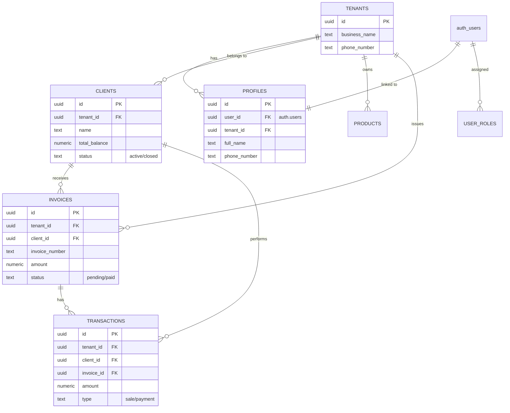

# Developer Documentation - Nunua Polepoe

Welcome to the developer-centric documentation for **Nunua Polepoe**. This guide is designed to help you understand the system architecture, database design, and how to contribute or add new features.

---

## 🏗️ Architecture Design

Nunua Polepoe follows a **Multi-tenant SaaS Architecture** using a backend-as-a-service approach provided by Supabase.

### Core Principles
1.  **Multi-Tenancy**: Data is partitioned by `tenant_id` across all tables.
2.  **Row Level Security (RLS)**: Data access is strictly controlled at the database level. Users can ONLY access data belonging to their `tenant_id`.
3.  **API-First**: The frontend interacts directly with Supabase via the client SDK, minimizing the need for a traditional backend server.
4.  **Edge Logic**: Business-critical or sensitive operations (like tenant setup or user creation) are handled by **Supabase Edge Functions** (Deno).
5.  **Domain Events**: Critical business events (payments, invoice creation) trigger side effects (notifications) via PostgreSQL Triggers and Functions.

---

## 🗄️ Database Design

The database is built on PostgreSQL. Below is the simplified schema layout.

### Entity Relationship Diagram (ERD)



### Key Tables
-   **`tenants`**: Represents the business/organization.
-   **`profiles`**: User metadata, linking a Supabase Auth user to a tenant.
-   **`user_roles`**: RBAC (Role-Based Access Control) entries (e.g., `admin`, `user`).
-   **`clients`**: The customers of the tenant.
-   **`transactions`**: Ledgers of financial activity (type `sale` increases debt, `payment` decreases it).

---

## 📁 Project Structure

```text
/
├── src/
│   ├── api/           # API service layers (wrappers around Supabase)
│   ├── components/    # Reusable UI components (shadcn/ui)
│   ├── hooks/         # Custom React hooks (useAuth, useQuery wrappers)
│   ├── pages/         # High-level page components (Dashboard, Clients, etc.)
│   └── integrations/  # Supabase client and auto-generated types
├── supabase/
│   ├── functions/     # Edge Functions (Deno)
│   └── migrations/    # PostgreSQL schema and RLS policies
```

---

## 🚀 Adding New Features

### 1. Adding a Database Change
All schema changes must be done via migrations.
```sh
# Generate a new migration
# (If using Supabase CLI locally)
supabase migration new feature_name
```
**Important**: Always include the `tenant_id` column and enable RLS:
```sql
ALTER TABLE public.new_table ENABLE ROW LEVEL SECURITY;
CREATE POLICY "Users can view their own tenant data" ON public.new_table
FOR SELECT USING (tenant_id = public.get_user_tenant_id());
```

### 2. Adding a New API Endpoint
Create a new file in `src/api/` (e.g., `src/api/reports.api.ts`). Use the `getCurrentTenantId` helper to ensure data isolation.

```typescript
import { supabase } from '@/integrations/supabase/client';
import { getCurrentTenantId } from './tenant.api';

export const getReportData = async () => {
    const tenantId = await getCurrentTenantId();
    const { data, error } = await supabase
        .from('reports')
        .select('*')
        .eq('tenant_id', tenantId);
    if (error) throw error;
    return data;
};
```

### 3. Adding an Edge Function
Place new functions in `supabase/functions/`. They are useful for:
- Sending SMS/Email.
- Complex calculations spanning multiple tables.
- Actions requiring Service Role (Bypassing RLS).

---

## 🛠️ Best Practices
-   **Optimized Queries**: Avoid N+1 problems. Use `.select('*, related_table(*)')` or aggregate functions when possible.
-   **Type Safety**: Always use the generated types from `@/integrations/supabase/types`.
-   **Permissions**: Use `has_role` PostgreSQL function in policies to restrict administrative actions to `admin` users.
-   **Visual Consistency**: Use `shadcn/ui` components and the established Tailwind theme.
